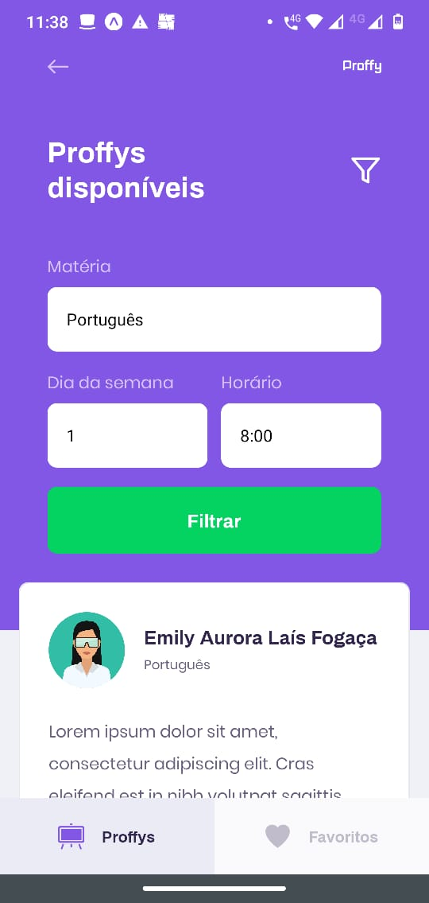

<p align="center">
   
</p>

<p align="center">
   
</p>

<p align="center">	
  <a href="https://www.linkedin.com/in/alexandre-souza-b18a1936/" target="_blank">
    
  </a>
  <a aria-label="Completed" href="https://nextlevelweek.com/episodios/omnistack/edicao/2" target="_blank">
    </img>
  </a>
  <a href="https://github.com/assoares383/proffy/commits/master" target="_blank">
    
  </a> 
  
</p>

> :rocket: Proffy is an online study platform that brings together teachers and students who want to learn about a certain subject, a project developed next week at level 2 @Rocketseat

### Web Screenshot

<div>
   
   
   
</div>

### Mobile Screenshot

<div>
   
   
   
   
   
   
</div>

# :computer: Technologies

This project was made using the follow technologies:

- [Typescript](https://www.typescriptlang.org/)
- [React](https://reactjs.org/)
- [Expo](https://expo.io/)
- [Express](https://expressjs.com/)

# :construction_worker: How to run

```bash
# Clone Repository
$ git clone https://github.com/assoares383/proffy.git
```

### 📦 Run API

```bash
# Go to server folder
$ cd Proffy/server

# Install Dependencies
$ yarn install

# Run Aplication
$ yarn start
```

Access API at http://localhost:3333/

### 💻 Run Web Project

```bash
# Go to web folder
$ cd Proffy/web

# Install Dependencies
$ yarn install

# Run Aplication
$ yarn start
```

Go to http://localhost:3000/ to see the result.

### 📱 Run Mobile Project

To run the mobile project you need a cellphone with the app of [expo](https://play.google.com/store/apps/details?id=host.exp.exponent) instaled or a emulator android/ios.
<br />
After, fork this repository and clone to your machine. Inside of the project's folder run the following commands:

```bash
# Go to mobile folder
$ cd Proffy/mobile

# Install Dependencies
$ yarn install

# Run Aplication
$ yarn start
```

Aferter read the QRCode with the app of [expo](https://play.google.com/store/apps/details?id=host.exp.exponent) or run on emulator.
